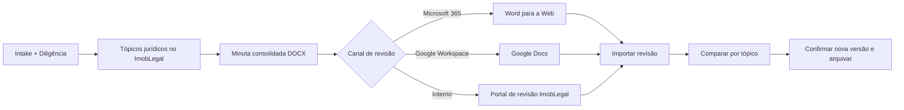

# Recomendação de conectores Word para o ImobLegal

**Autor:** Manus AI  
**Data:** 25 de agosto de 2026  
**Decisão recomendada:** manter o **ImobLegal como fonte jurídica de verdade** e adicionar conectores de edição como saídas controladas, começando por **Microsoft Word via Microsoft 365/Graph** para clientes que exigem Word nativo. O Google Docs deve ser uma opção secundária de colaboração, e não o editor padrão. Um editor incorporado somente deve ser adotado após comprovar demanda por edição Word dentro do próprio sistema.

## Resposta direta

**Sim, é possível usar Google Docs.** A API do Google Docs cria e modifica documentos, trabalha com intervalos nomeados e suporta sugestões antes da aceitação definitiva.[1] O Drive API armazena os arquivos e suporta upload resumível para transferências maiores ou sujeitas a interrupção.[2] Contudo, Google Docs converte o contrato para o modelo nativo do Google e introduz uma segunda fonte de verdade, com governança de permissões, propriedade e conversão DOCX a administrar.

Para uma imobiliária ou escritório cuja revisão final ocorre efetivamente no Word, a solução mais adequada é **Microsoft 365 + Microsoft Graph + abertura do Word para a Web**. O Graph administra arquivos no OneDrive ou SharePoint e oferece permissões delegadas ou de aplicativo para leitura e escrita; o Word para a Web é a camada de experiência nativa de edição.[3] O Graph, isoladamente, não substitui um editor Word rico incorporado: ele é o conector de armazenamento, permissões, upload, versão e compartilhamento.

> **Recomendação:** o ImobLegal deve continuar a criar a minuta juridicamente controlada por tópicos. A edição externa deve abrir uma **versão publicada e rastreável** do DOCX, com retorno deliberado ao dossiê; nunca deve substituir a lógica de intake, diligência, exceções e aprovação interna.

## Critérios de decisão

O fluxo do ImobLegal exige mais do que um campo rico de texto. A ferramenta precisa preservar a ligação entre intake, diligência, tópicos jurídicos, contrato padrão, exceções, aprovação e dossiê. Também precisa evitar que uma edição externa apague a trilha de decisão que sustenta a minuta. Assim, os critérios mais importantes são fidelidade DOCX, governança de versão, colaboração, comentários/revisões, integração com o backend TypeScript, segurança dos arquivos e esforço operacional.

| Critério | Peso para o ImobLegal | Motivo |
|---|---:|---|
| Fonte jurídica de verdade | Muito alto | A minuta deve continuar ligada aos tópicos, exceções e evidências do negócio. |
| Fidelidade DOCX | Muito alto | Corretores, clientes, advogados e cartórios trabalham com Word. |
| Rastreabilidade | Muito alto | É necessário registrar quem publicou, editou, aprovou e consolidou a versão. |
| Colaboração e comentários | Alto | A revisão pode envolver cliente, corretor e jurídico. |
| Implantação no stack atual | Alto | O ImobLegal é React + TypeScript + Express em hospedagem gerenciada. |
| Privacidade e permissões | Muito alto | Contratos e certidões contêm dados pessoais e patrimoniais. |
| Custo e operação | Médio | Deve crescer sem introduzir um serviço pesado prematuramente. |

## Comparação de alternativas

| Opção | Papel ideal | Pontos fortes | Limitações relevantes | Decisão |
|---|---|---|---|---|
| **Fluxo atual do ImobLegal + DOCX** | Núcleo jurídico e geração controlada | Integra intake, diligência, IA, exceções, revisão e dossiê; já gera Word. | Não reproduz toda a experiência de edição livre do Word. | **Manter como fonte de verdade.** |
| **Microsoft 365 Word + Graph** | Edição final nativa para clientes M365 | Mantém DOCX como formato nativo; Graph gerencia arquivos e permissões; bom encaixe corporativo. [3] | Exige OAuth Microsoft por organização e integração com OneDrive/SharePoint. | **Primeira integração recomendada.** |
| **Google Docs + Drive API** | Colaboração externa rápida | API cria/modifica documentos, possui sugestões e intervalos nomeados. [1] [2] | Converte DOCX para o modelo Google; aumenta a complexidade de sincronização e propriedade. | **Opcional, após Word/Graph.** |
| **OnlyOffice Docs** | Editor Word incorporado e colaborativo | Editor integrado, coedição, usuário, templates e callbacks de persistência. [4] | Requer serviço de edição e callback seguro; autohospedagem traz operação persistente. | **Candidato para fase posterior.** |
| **Apryse DOCX Editor** | Editor incorporado comercial de alta qualidade | Edita DOCX no navegador, salva DOCX, inclui comentários e revisão; integra com React. [5] | Add-on comercial e sem suporte a navegadores móveis, segundo a documentação. | **Melhor candidato de editor embutido pago.** |
| **Syncfusion Document Editor** | Editor incorporado com serviços próprios | Abre DOCX e fornece recursos de formatação, proteção e exportação. [6] | Funções de importação/conversão dependem de serviço server-side em .NET ou Java. | **Baixa aderência ao backend Node atual.** |
| **Aspose.Words Cloud** | Automação e conversão de documentos | Cria, abre, modifica, converte e salva DOCX/PDF via API. [7] | Não é um editor colaborativo completo para o usuário final. | **Útil como serviço de automação complementar.** |
| **Collabora Online** | Editor open-source baseado em WOPI | Opção de editor office incorporado e aberta. | Requer host WOPI e serviço de documentos; aumenta complexidade operacional. | **Avaliar apenas com infraestrutura dedicada.** |

## Arquitetura recomendada

### Camada 1 — ImobLegal continua soberano

O contrato nasce e é governado no ImobLegal. O intake contratual obrigatório alimenta os tópicos jurídicos; a due diligence fornece evidências; o contrato padrão determina a base textual; e a IA ajuda a reelaborar cada tópico sob supervisão humana. A consolidação gera um DOCX versionado, imutável como **versão publicada**.

Esse DOCX deve ter um identificador de versão, hash de conteúdo, lista de tópicos consolidados, contrato padrão de origem, usuário responsável e data de publicação. Assim, a abertura em outro editor não corrompe a matriz jurídica interna.

### Camada 2 — Conector de edição externo, por preferência do cliente

Para clientes Microsoft 365, o ImobLegal cria ou atualiza um arquivo DOCX em uma pasta controlada no OneDrive ou SharePoint do cliente por meio do Graph. A aplicação guarda o `driveItemId`, o link compartilhado, a versão enviada e o momento de sincronização. O usuário abre o arquivo no Word para a Web, utiliza comentários e controle de alterações nativos, e depois seleciona **Sincronizar revisão** no ImobLegal.

Para clientes Google Workspace, o produto pode publicar uma cópia em Google Docs, manter o `documentId` e oferecer uma ação explícita de importar/consolidar a revisão. O uso de sugestões do Google Docs é interessante para revisão, mas o retorno deve passar por uma comparação contra a versão publicada antes de substituir ou criar uma nova minuta.

### Camada 3 — Retorno controlado ao dossiê

O retorno da revisão externa não deve gravar diretamente no contrato ativo. O sistema deve criar uma proposta de nova versão: receber o DOCX/Google Doc convertido, comparar o texto com a versão publicada, apontar alterações por tópico e exigir confirmação do operador jurídico. Após a confirmação, o dossiê guarda tanto a versão anterior quanto a nova, com o respectivo evento de auditoria.

## Por que não usar Google Docs como padrão

O Google Docs é plenamente possível, mas não é o padrão recomendado para este produto. O principal problema não é técnico; é de **governança documental**. Um contrato jurídico pode ser copiado, movido, ter proprietário alterado e receber sugestões fora do contexto da plataforma. Além disso, o contrato final continuará, na maioria dos casos, sendo entregue em DOCX ou PDF. O ImobLegal passaria a administrar conversões de ida e volta entre dois modelos de documento.

O conector Google Workspace existente na sessão está desabilitado e, mesmo que seja ativado para tarefas assistidas, ele não deve ser confundido com a integração de produção do site. O produto precisa de seu próprio OAuth Google, consentimento por organização, escopos mínimos, política de armazenamento e registro de auditoria.

## Por que Microsoft 365 deve ser a primeira opção externa

O Microsoft Graph suporta upload e substituição de conteúdo em OneDrive e SharePoint, com permissões que devem seguir o princípio de menor privilégio.[3] Isso se alinha ao fato de que o ImobLegal já produz DOCX e de que o usuário jurídico tende a esperar fidelidade Word, comentários, controle de alterações e formatação de cláusulas.

Além disso, a integração pode permanecer modular. Clientes sem Microsoft 365 continuam usando os tópicos do ImobLegal, o portal de revisão e o download DOCX; clientes com Microsoft 365 ganham o botão **Abrir no Word**. Não há motivo para obrigar toda a base a migrar de editor.

## Quando considerar um editor embutido

Um editor embutido só deve entrar quando houver evidência de que os usuários precisam editar contratos extensos **sem sair do ImobLegal**. Entre as opções pesquisadas, o Apryse possui a proposta mais direta para React e DOCX: edição, comentários e revisão no navegador, com salvamento de DOCX, mas é um add-on comercial e não suporta mobile browsers.[5] O OnlyOffice oferece colaboração e integração por callback, porém exige uma camada de serviço documental e persistência que não se encaixa como dependência leve da hospedagem autoscale atual.[4]

O Syncfusion é tecnicamente capaz, mas suas operações server-side descritas para importação e conversão de DOCX dependem de APIs .NET ou Java.[6] Isso introduziria um segundo runtime para um projeto hoje centrado em Node/TypeScript. O Aspose é melhor usado nos bastidores para geração, conversão e validação, não como editor do cliente final.[7]

## Plano de adoção

| Etapa | Escopo | Resultado |
|---|---|---|
| **Agora** | Consolidar tópicos jurídicos, DOCX, revisão por link e auditoria interna. | O ImobLegal mantém uma cadeia jurídica íntegra sem editor livre. |
| **Próxima entrega** | Criar adaptador `ExternalDocumentProvider` e conectar Microsoft 365 por OAuth. | Botão “Abrir no Word”, versão publicada e retorno controlado. |
| **Depois** | Oferecer Google Docs como opção de colaboração por organização. | Publicação e retorno explícitos de Google Docs, sem mudar a fonte de verdade. |
| **Somente com demanda validada** | Avaliar Apryse ou OnlyOffice para edição incorporada. | Editor Word dentro do ImobLegal com business case e arquitetura adequados. |

## Decisão final

**A melhor solução para o ImobLegal não é substituir o elaborador atual por Google Docs ou Word.** A melhor solução é manter o elaborador jurídico como a camada de inteligência e governança e oferecer o **Microsoft Word/Graph como conector externo prioritário** para a edição final quando necessário. O Google Docs deve ser opcional para organizações que operam nativamente no Google Workspace. Apryse é o melhor candidato se, futuramente, houver necessidade comprovada de um editor Word embutido; OnlyOffice e Collabora exigem uma decisão consciente de operar infraestrutura documental dedicada.

## Referências

[1] [Google Docs API overview](https://developers.google.com/docs/api)  
[2] [Google Drive API — upload file data](https://developers.google.com/drive/api/guides/manage-uploads)  
[3] [Microsoft Graph — upload or replace driveItem content](https://learn.microsoft.com/en-us/graph/api/driveitem-put-content)  
[4] [OnlyOffice Docs API — editor configuration](https://api.onlyoffice.com/docs/docs-api/usage-api/config/editor/)  
[5] [Apryse WebViewer — DOCX Editor overview](https://docs.apryse.com/web/guides/docx-editor)  
[6] [Syncfusion — web services for JavaScript DOCX Editor](https://help.syncfusion.com/document-processing/word/word-processor/javascript-es6/web-services-overview)  
[7] [Aspose.Words Cloud documentation](https://docs.aspose.cloud/words/)
