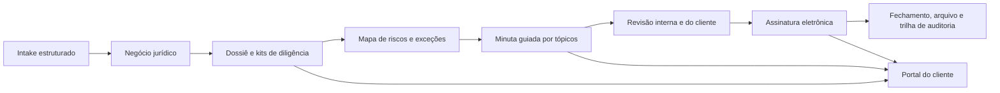

# Relatório estratégico: Pipeimob como referência para o ImobLegal

**Autor:** Manus AI  
**Data:** 25 de agosto de 2026  
**Escopo:** análise de referências públicas do Pipeimob e observação não intrusiva de uma transação autenticada disponibilizada pelo usuário.

## Resumo executivo

O Pipeimob não deve ser lido apenas como um CRM imobiliário. A proposta de produto é a de um **sistema operacional transacional**: conectar captação, proposta, documentação, contrato, assinatura, escritura, comissão e, em alguns casos, dinheiro em trânsito. Essa tese aparece tanto na navegação autenticada quanto na comunicação pública do produto, que organiza o portfólio em CRM, TRM, locação, banking, antecipação e cartórios.[1] [2]

O ponto mais relevante para o ImobLegal é a mudança de unidade de trabalho. O Pipeimob trata o **negócio** como uma pasta operacional viva, com marcos, tarefas, documentos, responsáveis, histórico e ações rápidas. O ImobLegal já possui uma base forte de intake, due diligence, revisão jurídica, painel do cliente, Copiloto Jurídico, comentários de minuta e elaborador por tópicos. A oportunidade não é reproduzir um ERP imobiliário completo; é consolidar a posição de **legal transaction workspace**: o ambiente em que a imobiliária reduz risco, produz documentos, registra decisões e conduz o processo jurídico até sua formalização.

> “Transação centralizada: Do primeiro ‘olá’ até a assinatura do contrato no mesmo sistema.” — posicionamento do Pipeimob.[1]

O melhor caminho é incorporar os **padrões operacionais** do Pipeimob — esteira explícita, dossiê estruturado, kits, responsabilidades, automação de passagem de bastão e auditoria — mantendo a diferenciação do ImobLegal em inteligência jurídica, qualidade documental e governança da minuta. Banking, escrow e antecipação devem ser considerados extensões futuras via parceiros regulados, e não o núcleo do produto.

| Conclusão | Implicação para o ImobLegal |
|---|---|
| A ficha do negócio deve ser a fonte única de verdade. | Evoluir o painel atual para uma esteira de execução jurídico-operacional. |
| Documentos só ganham valor quando têm contexto, prazo, dono e consequência. | Transformar o dossiê em evidência rastreável, não em repositório de arquivos. |
| O contrato precisa ser guiado por dados e exceções. | Consolidar os tópicos jurídicos com regras de completude, justificativas e aprovações. |
| O cliente deve enxergar o andamento sem acessar dados internos. | Expandir o portal do cliente com marcos, solicitações e confirmações controladas. |
| Integrações externas são multiplicadores, não pré-requisito inicial. | Priorizar assinatura e emissão/consulta de documentos antes de cartórios e financeiro. |

## Método, fontes e limites

A análise combinou páginas oficiais, central de ajuda, reportagem setorial e observação de um processo autenticado oferecido pelo usuário. Na observação privada, foram consultadas apenas telas de leitura e navegação; nenhum documento foi baixado, nenhum dado foi alterado e nenhum termo de uso foi aceito. Os nomes de partes e demais dados pessoais da transação não foram incluídos neste relatório.

As afirmações sobre funcionalidades públicas são citadas. Métricas comerciais divulgadas pelo fornecedor foram tratadas como **alegações institucionais**, não como auditoria independente. A observação autenticada reflete uma amostra de um processo e não permite inferir toda a configuração disponível a cada cliente.

| Fonte | Uso no relatório | Limitação |
|---|---|---|
| Site e páginas de produto do Pipeimob | Estratégia, posicionamento e módulos declarados. | Comunicação de marketing. |
| Central de ajuda | Fluxos específicos de certidões, contratos e assinatura. | Pode não cobrir configurações de todos os clientes. |
| Transação autenticada aberta pelo usuário | Arquitetura real de negócio, documentos, timeline e ações. | Uma única amostra; sem operar ações de escrita. |
| Startups.com.br | Contexto externo de integração cartorial. | Reportagem sobre anúncio e planos da empresa. |

## O que o Pipeimob construiu

### Uma arquitetura de produtos em volta da transação

O Pipeimob posiciona o CRM como porta comercial e o TRM como camada posterior à proposta: uma transferência contínua de dados do comercial para jurídico, documentação e financeiro.[2] [3] Sua página de locação adota a mesma lógica em quatro blocos: pré-análise das partes, contratos e assinatura, financeiro e central de comunicação.[4]

| Camada | Capacidades observadas ou declaradas | Aprendizado de produto |
|---|---|---|
| Aquisição e CRM | Leads, funil, imóveis, histórico, roleta, WhatsApp e IA. [3] | A entrada de dados deve reduzir atrito para o corretor. |
| TRM e pós-proposta | Dossiê, etapas, certidões, contrato, escritura, comissões e visibilidade operacional. [2] | O negócio precisa continuar vivo depois do “sim”. |
| Contratos | Modelos, variáveis, inconsistências, DOCX/PDF, assinatura e salvamento no dossiê. [7] | O gerador deve separar dados confiáveis, campos editáveis e lacunas. |
| Diligência documental | Kits de certidões, emissão, análise de matrícula e acompanhamento. [6] | A due diligence ganha escala com configuração reutilizável por tipo de negócio. |
| Assinatura e formalização | Ordem de assinatura, prazo, observadores, canais de token e automações de avanço. [5] | Formalização é um fluxo controlado, não apenas um botão de envio. |
| Financeiro | Cobrança, split, antecipação, escrow/CompraSegura e notas fiscais. [8] [9] | O financeiro deve ser conectado às condições do negócio, não gerido em planilhas isoladas. |
| Cartórios | Integração de documentos, pendências e acompanhamento de escritura. [10] | A etapa registral precisa de visibilidade e comunicação estruturada. |

### A experiência de uma transação autenticada

Na transação analisada, o cabeçalho traduzia o ciclo de vida em marcos: início, contrato assinado, escritura, comissão, registro e entrega de chaves. Abaixo, a operação se divide em detalhes, documentos e timeline. A visão de detalhes reúne pendências, partes, equipe, corretores, parceiros, valores e ações rápidas; o andamento usa blocos de trabalho como documentos, contrato/sinal, escritura/financiamento, etapas finais e relacionamento. Cada bloco contém tarefas com estado próprio.

Esse desenho é particularmente eficaz por três motivos. Primeiro, a equipe compreende a situação do processo em poucos segundos. Segundo, o trabalho está decomposto em unidades pequenas e atribuíveis. Terceiro, uma pendência não fica abstrata: ela é exibida perto da etapa que bloqueia.

Na aba documental, a plataforma oferece upload, busca, exibições por pasta, cliente, documento, favoritos e anexados recentemente. Pastas indicam quantidade de arquivos e quem tem acesso. A timeline registra eventos por tipo, data, usuário e descrição, além de filtros por período e usuário. O menu de ações inclui abertura de formulário, registro de atividade, logs e arquivamento. Esses elementos formam uma espinha de **auditabilidade operacional**.

### O padrão de contrato: variáveis, exceções e formalização

O fluxo de contratos personalizados do Pipeimob expõe uma decisão de UX relevante: antes de gerar, classifica dados em variáveis editáveis, personalizadas e inconsistentes. O operador não precisa descobrir silenciosamente que uma informação está ausente; ele é chamado a decidir.[7]

O CCV Conjurer amplia esse padrão ao organizar a elaboração em tópicos jurídicos: partes, objeto, compromisso, preço, posse, título definitivo, comissões, irretratabilidade/cominações, foro/privacidade e formatações. A referência apresenta alertas de consistência e recomendações associadas a tópicos. Esse padrão já orientou a evolução recente do ImobLegal e deve se tornar o centro da experiência de elaboração.

### O padrão de certidões: kits, pré-requisitos e visibilidade

O Pipeimob apresenta a emissão de certidões como uma rotina configurada por **kits**. Antes de finalizar, o operador visualiza certidões previstas e estimativa de emissão; pode escolher análise de matrícula, revisar dados faltantes e ajustar pesquisa de participação societária. [6] Trata-se de um modelo superior ao checklist genérico, pois vincula diligência à natureza da operação e à qualidade cadastral de cada parte.

## Comparação com o ImobLegal

O ImobLegal já cobre uma parte substancial da camada jurídica da transação. A comparação abaixo não é uma avaliação de “quem tem mais funções”, mas de aderência ao objetivo definido para o ImobLegal: guiar o operador da coleta de dados à minuta, diligência, revisão e conclusão com qualidade jurídica.

| Domínio | Pipeimob | ImobLegal atual | Leitura estratégica |
|---|---|---|---|
| Intake e passagem de bastão | CRM → TRM com dados nativos. [3] | Intake compartilhável vinculado ao negócio. | Base adequada; falta uma visão de completude e origem por tópico. |
| Painel de negócio | Marcos, tarefas, responsáveis, pendências e ações rápidas. | Métricas, progresso, intakes, contratos, diligência e cliente. | Prioridade alta para aproximar o painel de uma esteira executável. |
| Dossiê e documentos | Pastas, acesso, favoritos, busca, timeline e certidões. | Anexos seguros e dossiê do cliente. | Prioridade alta para taxonomia, permissões e evidência por etapa. |
| Due diligence | Kits, emissão, estados e possíveis integrações estaduais/nacionais. [6] | Checklist por negócio e IA de triagem de risco. | Diferencial jurídico do ImobLegal; deve receber kits, responsáveis e gatilhos. |
| Minuta e modelos | Variáveis, inconsistências, DOCX/PDF e assinatura. [7] | Word importado, tópicos guiados, revisão por cliente e DOCX final. | Vantagem atual em colaboração e IA; falta uma matriz de inconsistências formal. |
| Cliente | Visibilidade transacional e potencial de acompanhamento registral. [10] | Portal, dossiê, revisão por link, comentários e aprovação. | Consolidar o portal como “sala segura” do cliente. |
| Assinatura | Sequência, observadores, canais e expiração. [5] | Compartilhamento e aprovação da minuta; integração ainda preparada. | Próxima integração externa de maior impacto. |
| Financeiro | Cobrança, escrow, split e antecipação. [8] [9] | Fora do escopo atual. | Não deve ser prioridade do núcleo jurídico. |
| Cartórios | Integração e acompanhamento da escritura. [10] | Sem integração registral. | Adotar após maturar dossiê, assinatura e processo. |
| Auditoria | Logs, timeline e atividades. | Notificações, comentários e registros parciais. | Lacuna crítica para operação jurídica profissional. |

## O que incorporar — e o que não copiar

### Recomendações prioritárias

| Prioridade | Iniciativa | Por que incorporar | Resultado esperado | Dependências |
|---|---|---|---|---|
| P0 | **Esteira jurídico-operacional do negócio** | Materializa responsáveis, prazos, bloqueios e marcos após o intake. | Operador identifica o próximo passo e o gargalo sem abrir múltiplas abas. | Modelo de tarefas, responsáveis e eventos. |
| P0 | **Matriz de completude da minuta** | Converte campos ausentes, inconsistentes e sensíveis em decisões explícitas. | Menos lacunas silenciosas antes de compartilhar ou exportar. | Regras por tópico e proveniência de dados. |
| P0 | **Kits de diligência reutilizáveis** | Evita checklist manual e padroniza cada tipo de operação. | Certidões, documentos e riscos previstos por venda, locação ou situação especial. | Configurações de kit e regras de aplicabilidade. |
| P0 | **Linha do tempo auditável** | Registra eventos, autor, data, alteração, comentário, aprovação e exportação. | Rastreabilidade defensável para equipe e cliente. | Event store/tabela de atividades. |
| P1 | **Dossiê com taxonomia e acesso** | O arquivo deve espelhar a lógica do processo, não apenas armazenar uploads. | Pastas ou tags por parte, imóvel, certidão, contrato e fechamento; acesso por perfil. | Política de documentos e RBAC. |
| P1 | **Portal do cliente orientado por marcos** | Evolui de consulta documental para acompanhamento claro do processo. | Cliente vê o que foi concluído, o que depende dele e o que está em revisão. | Estados públicos e política de visibilidade. |
| P1 | **Assinatura eletrônica integrada** | Fecha a lacuna entre minuta aprovada e instrumento formalizado. | Envio, ordem, prazo, observadores e retorno de status no negócio. | Escolha do provedor e credenciais. |
| P1 | **Catálogo de exceções jurídicas** | Cria padrões para cláusulas não usuais, riscos e aprovações internas. | Operador trata exceções com justificativa e aprovação do responsável jurídico. | Biblioteca jurídica e regras de alçada. |
| P2 | **Emissão/consulta de certidões via parceiros** | Reduz trabalho operacional e atualiza o dossiê. | Solicitação e retorno integrados a kits e prazos. | Parceiro, cobertura e regras de custo. |
| P2 | **Handoff com cartórios** | Amplia o processo até a escritura e registro. | Checklist e pendências compartilháveis com a etapa registral. | Parceiro cartorial, segurança e modelo de dados. |
| P3 | **Integração financeira/escrow** | Pode ligar condição jurídica ao dinheiro da operação. | Menor risco de execução e comissionamento. | Parceiro regulado, compliance e desenho financeiro. |

### Limites estratégicos

O ImobLegal não deve tentar copiar a amplitude do Pipeimob de imediato. CRM de pré-venda, catálogo de imóveis, portal de anúncios, banking, antecipação, garantias e telefonia podem gerar volume, mas também diluem a tese jurídica e trazem dependências regulatórias ou comerciais relevantes. O risco seria construir uma versão incompleta de um ERP imobiliário, perdendo o diferencial de uma plataforma de operações jurídicas.

O foco recomendado é: **dados estruturados → diligência baseada em risco → minuta rastreável → revisão controlada → assinatura → dossiê de encerramento**. Essa cadeia é curta o suficiente para ser excelente e profunda o bastante para se tornar indispensável a corretores, imobiliárias e escritórios parceiros.

## Arquitetura de produto sugerida

> **Princípio de desenho:** todo dado precisa responder a quatro perguntas: de onde veio, quem o validou, onde é utilizado e o que bloqueia se estiver ausente.

### Estrutura recomendada para o painel do negócio

O painel deve ser organizado em três camadas simultâneas. A primeira é uma régua de marcos — intake, diligência, minuta, revisão, assinatura, fechamento. A segunda é a lista de trabalho: tarefas, responsáveis, prazo, bloqueio e evidência. A terceira é a camada de prova: documentos, certidões, comentários, versões e logs.

| Camada | Informação principal | Pergunta que responde |
|---|---|---|
| Marco | Etapa atual e próximo evento. | “Onde este processo está?” |
| Trabalho | Pendências, dono, prazo e prioridade. | “O que precisa acontecer agora?” |
| Prova | Documento, validação, decisão e evento. | “Por que consideramos este ponto concluído?” |

## Roadmap de incorporação

### Fase 1 — consolidar a espinha jurídica (0–45 dias)

A primeira fase deve transformar recursos existentes em um fluxo coerente. Ações: criar marcos configuráveis de processo; tarefas com responsável e SLA; linha do tempo auditável; matriz de completude por tópico; e kits de diligência para compra e venda e locação. Nesta fase, o objetivo não é adicionar integrações externas, mas tornar explícitos os bloqueios que hoje permanecem distribuídos entre intake, due diligence e minuta.

**Métricas sugeridas:** tempo entre intake completo e primeira minuta; percentual de minutas com tópico pendente; percentual de diligências concluídas dentro do SLA; número de reaberturas após revisão interna.

### Fase 2 — formalização e portal (45–90 dias)

A segunda fase deve conectar o trabalho jurídico ao fechamento. Ações: integração com assinatura eletrônica; política de visibilidade do portal; lembretes de revisão e assinatura; dossiê final de encerramento; e exportação de relatório de auditoria do processo. É o momento de transformar a aprovação do cliente em uma trilha de decisão formal.

**Métricas sugeridas:** tempo entre envio e aprovação; taxa de retorno de revisão; tempo de assinatura; percentual de processos com dossiê completo no arquivamento.

### Fase 3 — automação externa e especialização (90–180 dias)

A terceira fase deve priorizar integrações que alimentem o dossiê e reduzam tarefas repetitivas: certidões por parceiros, verificação de matrícula, integração cartorial e, somente após validação da tese, automações financeiras via instituições reguladas. Para locação, podem ser introduzidos módulos específicos de garantia, crédito e comunicação; porém eles devem permanecer separados do núcleo de compra e venda.

**Métricas sugeridas:** percentual de certidões obtidas sem trabalho manual; tempo até saneamento de pendência registral; custo operacional por processo; redução de documentos solicitados mais de uma vez.

## Requisitos de governança

O crescimento do ImobLegal deve preservar a premissa de apoio jurídico, não de substituição da decisão profissional. A IA deve exibir fonte, nível de confiança, limitações e próximo passo recomendado; a decisão final deve ser registrada por usuário responsável. Documentos devem ter classificação, política de retenção, permissões e histórico de compartilhamento. Integrações financeiras, KYC, crédito e custódia devem ocorrer apenas por parceiros adequados e mediante análise regulatória e contratual específica.

Também é recomendado evitar copiar a interface, textos, taxonomia proprietária ou materiais do Pipeimob. O ImobLegal deve adotar os princípios de produto — fluxo, rastreabilidade, orientação e dossiê — com linguagem jurídica própria e uma experiência compatível com sua identidade.

## Decisões recomendadas para o próximo ciclo

1. Aprovar a criação de uma **esteira jurídico-operacional** com marcos, tarefas, responsáveis e eventos auditáveis.
2. Priorizar **kits de diligência** e **matriz de completude da minuta** antes de qualquer integração financeira ou cartorial.
3. Escolher um provedor de assinatura eletrônica para conectar aprovação, envio, status e dossiê final.
4. Definir o escopo do portal do cliente: o que é visível, o que exige ação e quem pode ver documentos.
5. Criar um comitê de produto jurídico para versionar cláusulas, regras de exceção e recomendações do Copiloto.

## Referências

[1] [Pipeimob — Página principal](https://pipeimob.com.br/)  
[2] [Pipeimob — TRM](https://pipeimob.com/pt-br/trm)  
[3] [Pipeimob — CRM](https://pipeimob.com/crm)  
[4] [Pipeimob — Esteira de locação](https://pipeimob.com/pt-br/esteira-de-locacao)  
[5] [Pipeimob — Como enviar contrato para assinatura](https://conhecimento.pipeimob.com/assinatura-digital)  
[6] [Pipeimob — Como emitir certidões](https://conhecimento.pipeimob.com/como-emitir-certidoes)  
[7] [Pipeimob — Modelo de contrato personalizado](https://conhecimento.pipeimob.com/como-utilizar-um-modelo-de-contrato-personalizado)  
[8] [Pipeimob — Banking](https://pipeimob.com/banking)  
[9] [Pipeimob — CompraSegura](https://conhecimento.pipeimob.com/conhe%C3%A7a-o-comprasegura)  
[10] [Startups.com.br — Pipeimob integra cartórios](https://startups.com.br/negocios/pipeimob-faz-novo-ma-e-integra-cartorios-na-plataforma/)  
[11] [Pipeimob — Transação autenticada consultada](https://app.pipeimob.com.br/vendas/1684466124899x319236176449641860)
